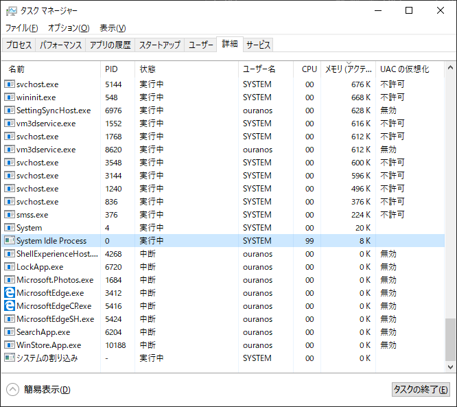
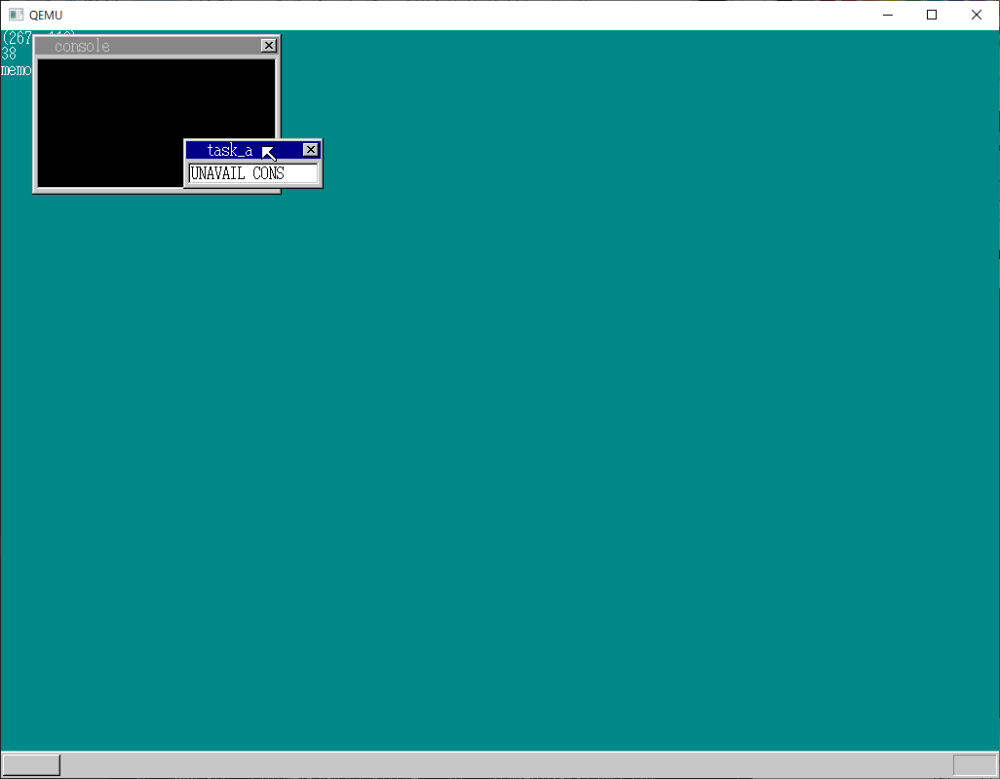
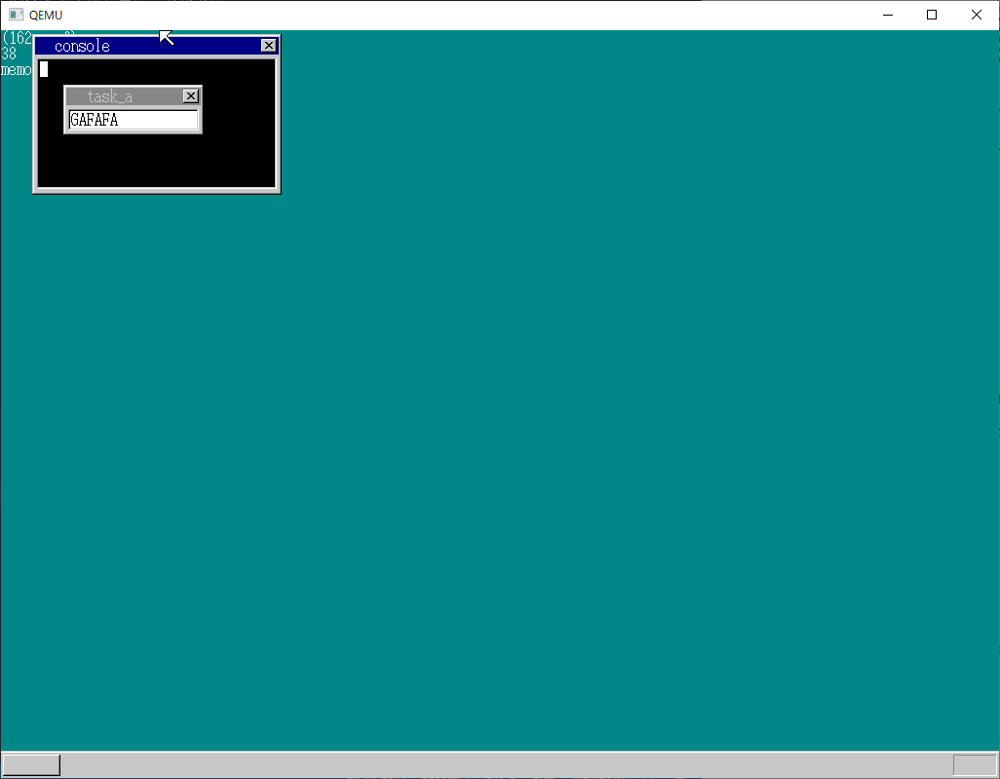
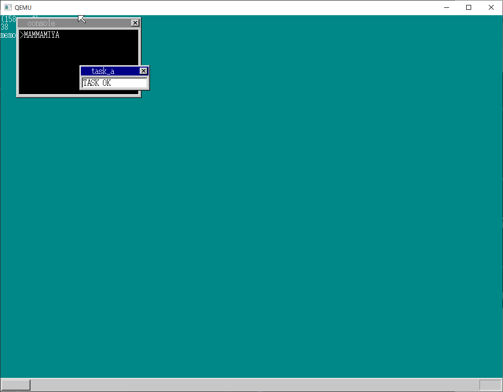
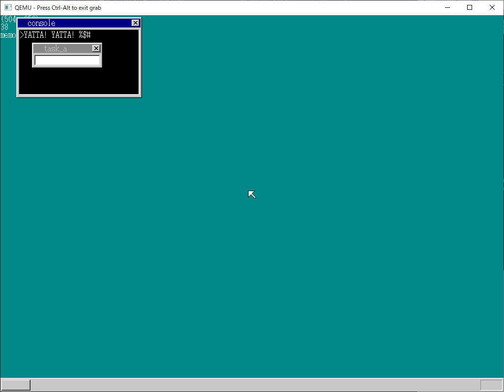
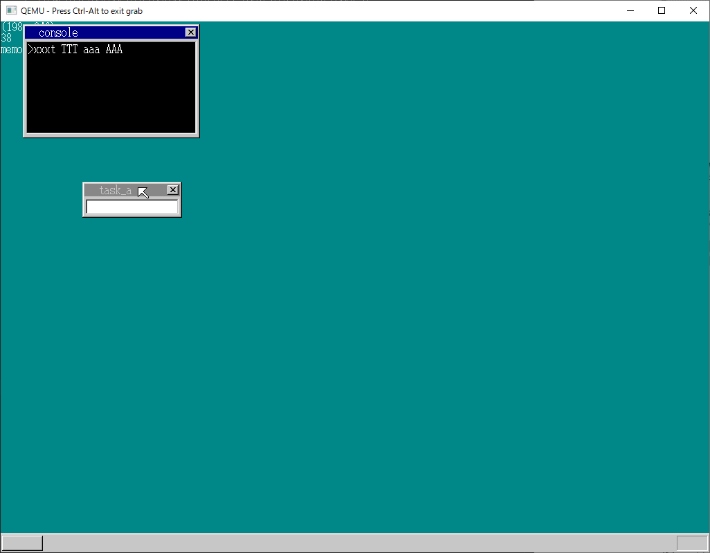

# コンソール
以降に出てくるタスク A は Window を一つだけ持つ OS (kernel) タスクみたいなもの？

### アイドルタスク (harib14a)
diff : [17_day/harib13e_14a.diff](17_day/harib13e_14a.diff)

- [17_day/harib14a/mtask.c](17_day/harib14a/mtask.c)
- [17_day/harib14a/bootpack.c](17_day/harib14a/bootpack.c)

- 上位タスクのスリープ中に、実行が必要な下位タスクがあるかどうかで挙動を変える必要がある
  - あれば下位タスクへ切り替え、なければ io_hlt()
- 「すべてのレベルにタスクがいない状態」について条件分岐を書きたくない
  - io_hlt() し続けるだけの番兵を作る
  - level = MAX_TASKLEVELS - 1, priority = 1 を設定

Windows にも idle task らしきものがある.



### コンソールを作ろう (harib14b)
diff : [17_day/harib14a_14b.diff](17_day/harib14a_14b.diff)

- [17_day/harib14b/bootpack.c](17_day/harib14b/bootpack.c)
- [17_day/harib14a/mtask.c](17_day/harib14a/mtask.c)
  - 前章で task_now() を定義済

- 複数作ることを考慮して, タスクB0..B2らと同じ扱いで作成する
- task_now で自身の番地を取得
  - データ入力がない間は sleep したい
  - sleep は mtask 内で処理している
  - 自身の番地を伝達しないと, どのタスクを sleep するのかわからない



### 入力切替をやってみる (harib14c)
diff : [17_day/harib14b_14c.diff](./17_day/harib14b_14c.diff)

- [17_day/harib14c/bootpack.c](17_day/harib14c/bootpack.c)

- フォーカスの実装. Tab をキー入力すると switch するようにする
- key_to 変数で記憶（１ビット）
- sht_cons: sheet_console



### 文字入力をできるようにしてみる (harib14d)
diff : [17_day/harib14c_14d.diff](17_day/harib14c_14d.diff)

- [./17_day/harib14d/bootpack.c](./17_day/harib14d/bootpack.c)

- タスクを作る際にデータ入力用の fifo buffer を一緒に用意する
  - struct TASK に含めて作成
- key_to 変数の値に応じてデータ入力対象 fifo を切り替え
  - コンソールへはキーコードではなく ASCII 文字コードを渡している
  - 表示処理はタスク A もコンソールもほぼ同じ



RPC やドライバの仕組みがあるとはいえ、このデータ通信の経路を管理するのしんどそうだな..

### 記号入力 (harib14e)
diff : [17_day/harib14d_14e.diff](17_day/harib14d_14e.diff)

- [./17_day/harib14e/bootpack.c](./17_day/harib14e/bootpack.c)

- shift 用の keytable1 を追加
- key_shift 変数で shift が押された状態かを記録（１ビット）
  - 順序がややこしいが key_shift の状態は場合分けの下のほうで判定している
  - `&= ~1` は `01` の補数 `10` との論理積をとる、すなわち右1ビットを 0 にする
- key_shift 変数の値に応じて使用する keytable を変更する
  - keytable を参照して文字コードを決定

```
01 : 左のみオン ; |= 1, &= ~2
10 : 右のみオン ; &= ~1, |= 2
00 : 全オフ ; &= ~1, &= ~2
11 : 全オン ; |= 1, |= 2
```



### 大文字と小文字 (harib14f)
diff : [17_day/harib14e_14f.diff](17_day/harib14e_14f.diff)

- [./17_day/harib14f/bootpack.c](./17_day/harib14f/bootpack.c)

- 先ほどの key_shift と CapsLock の状態を参照する
  - CapsLock ON かつ Shift ON も小文字になる
  - 入力文字が alphabet のときのみが対象
- `binfo->leds` から Caps 初期状態を取得
- ASCII だと大文字の文字コードへ 0x20 を足すと小文字の文字コードになる



短い. 現段階だと途中で CapsLock 状態を変えても反映されない.

### Lockキー対応 (harib14g)
diff : [17_day/harib14f_14g.diff](17_day/harib14f_14g.diff)

- [./17_day/harib14g/bootpack.c](./17_day/harib14g/bootpack.c)

- NumLock 対応
- 併せて、キーボード LED を OS 状態に合わせて制御する
  - 所定の手順に従いキーボードに ED xx というデータを送る. xx 部分はどの LED を光らせたいかで変化. 下位ビットから Scroll, Num, CapsLock の順
  - keycmd fifo buffer でキーボードへの送信データを管理
  - 無事送り終わったかどうかは keycmd_wait で管理（１ビット）
  - 失敗したら勝手に送りなおすようにしてある

NumLock はおしてもへんかがない..

キーボードの LED 制御は PC からできるのかーと思ったが、起動時強制 NumLock の設定が BIOS でできたねそういえば..これができるということはキーボードを使って（物理的に）３ビットの光信号が送れるのでは？MIDI演奏に合わせて光らせたりとか.
