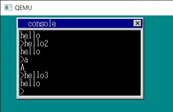
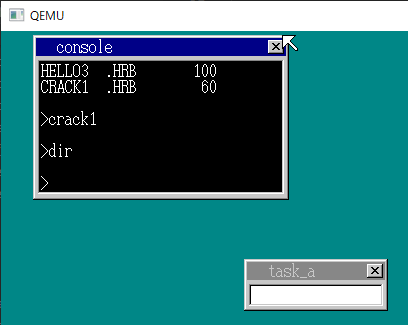
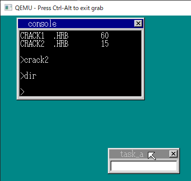
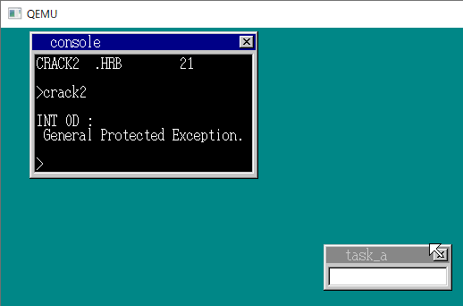

# OSを守ろう
### 文字列表示 API を今度こそ 18a
文字列を記憶するデータ領域をコードセグメント込みで指定したい.
memman_alloc_4k で確保したコードセグメントを (0xfe8) 番地へ保存する.

- cmd_app : 任意の実行ファイル（hello.nas, アセンブリ）を読みだして実行する. p.412
- hrb_api : system call api を実装した関数. IDT へ登録. 任意の実行ファイル（hello.nas, アセンブリ）から INT 0x40 命令で呼ばれる

[./21_day/harib17h_18a.diff](./21_day/harib17h_18a.diff)

```
+++ ./21_day/harib18a/console.c 2007-05-23 19:56:28.000000000 +0900
```

### アプリケーションを C 言語で作ってみたい 18b

- [a.c](./21_day/a.c), [hello3.c](./21_day/hello3.c) : アプリをアセンブラではなく C でかけるようにしたい.
  - INT 0x40 するだけの関数をアセンブラで用意する.
- [a_nask.nas](./21_day/a_nask.nas) : INT 0x40 命令を実行するだけのアセンブリ. アプリ (C 言語) のコンパイル結果とリンク
  - オブジェクトファイルのモード？
- アプリの実行バイナリ a.hrb に次の6バイトのコードを差し込まないと動かない
  - 0x1b (HariMain) を呼び出して終了後に far-RET する
  - console.c に差し込みコードを追加 // このコードは本章の最後まで残り続ける



[./21_day/harib18a_18b.diff](./21_day/harib18a_18b.diff)

```
+++ ./21_day/harib18b/Makefile  2021-01-12 04:46:06.262924617 +0900
+++ ./21_day/harib18b/console.c 2007-05-23 20:05:36.000000000 +0900
./21_day/harib18b のみに存在: a.c
./21_day/harib18b のみに存在: a_nask.nas
./21_day/harib18b のみに存在: hello3.c
```

### OS を守ろう (1) 18c

- [crack1.c](./21_day/crack.c) : 0x102600 に 0 を書き込むアプリ
  - なんの番地だっけ？



[./21_day/harib18b_18c.diff](./21_day/harib18b_18c.diff)

```
+++ ./21_day/harib18c/Makefile  2021-01-12 05:19:01.159184036 +0900
./21_day/harib18c のみに存在: crack1.c
```

### OS を守ろう (2) 18d

- OS 用のコード、データセグメントとアプリ用のコード、データセグメントを分離する
  - アプリの起動で OS の EIP, CS, ESP, DS/SS を退避
  - system call の呼び出しでアプリの EIP, CS, ESP, DS/SS を退避
  - アプリ起動中の割り込みへの対応
- QEMU では crack1 の妨害はできるが例外が発生しない

[./21_day/harib18c_18d.diff](./21_day/harib18c_18d.diff)

```
+++ ./21_day/harib18d/bootpack.h        2007-05-23 21:55:18.000000000 +0900
+++ ./21_day/harib18d/console.c 2007-05-23 21:52:50.000000000 +0900
+++ ./21_day/harib18d/naskfunc.nas      2007-05-23 22:01:00.000000000 +0900
```

### 例外をサポートしよう 18e

- 例外が起きると CPU は INT 0x0d に登録された関数を割り込み起動する
  - 今回は console.c へ実装
  - dsctbl.c 内で IDT 登録

[./21_day/harib18d_18e.diff](./21_day/harib18d_18e.diff)

```
+++ ./21_day/harib18e/bootpack.h        2007-05-24 00:10:18.000000000 +0900
+++ ./21_day/harib18e/console.c 2007-05-24 00:16:30.000000000 +0900
+++ ./21_day/harib18e/dsctbl.c  2007-05-24 00:26:22.000000000 +0900
+++ ./21_day/harib18e/naskfunc.nas      2007-05-24 00:07:04.000000000 +0900
```

### OS を守ろう (3) 18f

- crack2.nas : アセンブリ. 自らのデータセグメントへ OS 用のセグメントを代入する

[./21_day/harib18e_18f.diff](./21_day/harib18e_18f.diff)

```
+++ ./21_day/harib18f/Makefile  2021-01-12 05:41:01.659620242 +0900
./21_day/harib18f のみに存在: crack2.nas
```



### OS を守ろう (4) 18g

- セグメント定義時に, アクセス権に 0x60 を足したものを指定したセグメントは, CPU にアプリ用のセグメントと認識される
  - console.c と dsctbl.c を書き換え
- far-CALL も far-JMP も使えないので RETF でどうにかする
  - スタックとレジスタの状態を「アプリから CALL されたときのように」事前に設定しておく
- 18d で行った退避処理はすべて消す
  - CPU が自動で切り替えるため
- アプリ用の強制終了 API を作成する
  - OS から呼ばれていない（リターンが使えない）ので, アプリが自分で自らを終了する必要がある

[./21_day/harib18f_18g.diff](./21_day/harib18f_18g.diff)

```
+++ ./21_day/harib18g/Makefile  2021-01-12 05:55:40.425602088 +0900
+++ ./21_day/harib18g/a.c       2005-10-10 21:48:58.000000000 +0900
+++ ./21_day/harib18g/a_nask.nas        2005-10-10 21:49:34.000000000 +0900
+++ ./21_day/harib18g/bootpack.h        2007-05-24 23:28:28.000000000 +0900
+++ ./21_day/harib18g/console.c 2007-05-24 23:33:14.000000000 +0900
+++ ./21_day/harib18g/crack1.c  2005-10-10 21:50:32.000000000 +0900
+++ ./21_day/harib18g/crack2.nas        2005-10-10 21:51:28.000000000 +0900
+++ ./21_day/harib18g/dsctbl.c  2007-05-24 23:20:06.000000000 +0900
+++ ./21_day/harib18g/hello.nas 2005-10-10 21:27:00.000000000 +0900
+++ ./21_day/harib18g/hello2.nas        2005-10-10 21:27:22.000000000 +0900
+++ ./21_day/harib18g/hello3.c  2005-10-10 21:50:02.000000000 +0900
+++ ./21_day/harib18g/naskfunc.nas      2007-05-24 23:39:14.000000000 +0900
```


